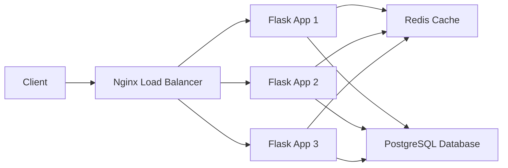

# URL Shortener Project Architecture

## README
### Setup Instructions
1. Install Python 3.11 or higher
2. Clone the repository:
   ```
   git clone https://github.com/yourusername/url-shortener.git
   cd url-shortener
   ```
3. Create a virtual environment and activate it:
   ```
   python -m venv venv
   source venv/bin/activate
   ```
4. Install dependencies:
   ```
   pip install -r requirements.txt
   ```
5. Set up the database:
   ```
   python setup_db.py
   ```
6. Start the application:
   ```
   flask run --port 5005
   ```
7. Access the application at `http://localhost:5005`

### Architecture Diagram


### API Documentation
- `POST /shorten` - Create a short URL
  - Request Body:
    ```json
    {
      "url": "https://example.com",
      "user_id": 1
    }
    ```
  - Response:
    ```json
    {
      "short_code": "abc123",
      "original_url": "https://example.com"
    }
    ```
- `GET /<short_code>` - Redirect to the original URL
- `GET /stats/<short_code>` - Get URL statistics
- `GET /users` - List users (paginated)
- `POST /users` - Create a user
- `GET /users/<id>` - Get user by ID
- `PUT /users/<id>` - Update user
- `DELETE /users/<id>` - Delete user
- `GET /events` - List events

## Deploy Guide
1. Set up a server with Docker and Docker Compose installed
2. Clone the repository on the server
3. Create a `.env` file with the necessary environment variables (see Config section)
4. Build and start the containers:
   ```
   docker-compose up -d
   ```
5. To rollback, stop the containers and revert to a previous version:
   ```
   docker-compose down
   git checkout <previous-version>
   docker-compose up -d
   ```

## Troubleshooting
- If the application is not responding, check if the Flask and Nginx containers are running:
  ```
  docker-compose ps
  ```
- If the database connection fails, verify the database credentials in the `.env` file and ensure the PostgreSQL container is running.
- If Redis cache is not working, check the Redis connection settings and ensure the Redis container is running.

## Config
The following environment variables are required to run the application:
- `DATABASE_URL`: PostgreSQL database connection URL (e.g., `postgresql://user:password@db/url_shortener`)
- `REDIS_URL`: Redis cache connection URL (e.g., `redis://cache`)
- `SECRET_KEY`: Flask secret key for session management
- `APP_PORT`: Port number for the Flask application (e.g., `5005`)

## Runbooks
- High CPU Usage:
  1. Check the Flask and Nginx access logs for any suspicious requests or high traffic
  2. Identify the cause of the high CPU usage (e.g., inefficient code, excessive requests)
  3. Optimize the code or add rate limiting if necessary
  4. Scale up the number of Flask app instances if needed
- Database Connection Errors:
  1. Verify the database credentials in the `.env` file
  2. Check if the PostgreSQL container is running and accessible
  3. Inspect the PostgreSQL logs for any errors or issues
  4. Restart the PostgreSQL container if necessary

## Decision Log
- **Flask**: Chosen for its simplicity, flexibility, and extensive ecosystem for building web applications in Python.
- **PostgreSQL**: Selected for its robustness, reliability, and support for ACID transactions, which are essential for a URL shortener application.
- **Redis**: Used for caching to improve application performance and reduce database load. Redis is an in-memory data store known for its speed and efficiency.
- **Nginx**: Employed as a load balancer to distribute incoming requests across multiple Flask app instances, ensuring high availability and scalability.
- **Peewee ORM**: Picked for its lightweight and intuitive API, making it easy to interact with the PostgreSQL database from Python code.
- **Docker**: Utilized for containerization, enabling consistent and reproducible deployments across different environments.

## Capacity Plan
The current architecture can handle a significant number of users and requests, thanks to the load balancing and caching mechanisms in place. However, the exact capacity depends on various factors, such as server resources, database size, and request patterns.

To estimate the capacity:
1. Conduct load testing using tools like Apache JMeter or Locust to simulate high traffic scenarios
2. Monitor system resources (CPU, memory, disk I/O) during the load tests
3. Analyze the response times and error rates to identify performance bottlenecks
4. Optimize the code and infrastructure based on the load testing results
5. Consider scaling horizontally by adding more Flask app instances and database replicas as the user base grows

With proper optimization and scaling, the URL shortener application can handle thousands of concurrent users and millions of daily requests. However, it's essential to regularly monitor the system performance and make adjustments as needed to ensure a smooth user experience.

---

This project architecture document provides a comprehensive overview of the URL shortener application, including setup instructions, architecture diagram, API documentation, deployment guide, troubleshooting tips, configuration details, runbooks, decision log, and capacity planning considerations.

By following this document, developers can easily understand the project structure, set up the application locally, deploy it to a production environment, and handle common issues. The decision log provides insights into the technical choices made during development, while the capacity plan outlines the scalability aspects of the application.

Remember to keep this document updated as the project evolves, and feel free to expand on each section based on your specific requirements and implementation details.
